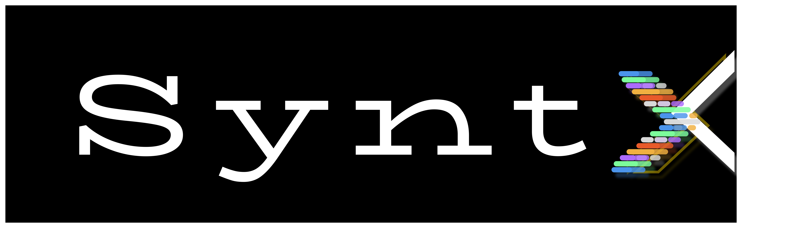

**Code with Flow, Build with Purpose**  

---

## Tentang Kami
SyntxFlow adalah sebuah organisasi kecil yang lahir dari hobi dan kecintaan kami terhadap dunia software development.  
Kami membangun proyek-proyek open source berupa **website, aplikasi, dan tools sederhana** dengan tujuan untuk belajar, bereksperimen, serta berbagi dengan komunitas developer.

---

## Visi & Misi
- Membuat proyek software open source yang sederhana, bermanfaat, dan bisa dipelajari orang lain.  
- Menjadi wadah belajar dan berkolaborasi dalam dunia teknologi.  
- Menumbuhkan budaya coding yang santai tapi tetap profesional.  

---

## Fokus Kami
-  **Website Development** – dari static page hingga web app interaktif.  
-  **Mobile Apps** – aplikasi kecil berbasis Android/iOS (eksperimen/hobi).  
-  **Tools & Utilities** – project kecil yang mempermudah workflow developer.  

---

## Catatan
Organisasi ini **tidak berorientasi profit**.  
Kami membuat semuanya murni karena **hobi, belajar, dan kesenangan dalam berkarya**.

---

## Tetap Terhubung
-  GitHub: [SyntxFlow](https://github.com/SyntxFlow)
